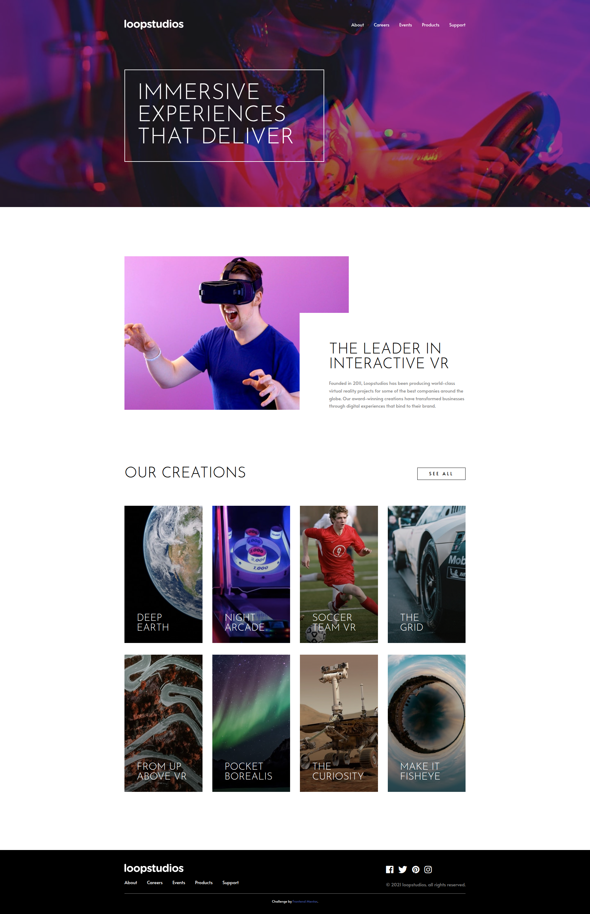

# Frontend Mentor - Loopstudios landing page solution

This is a solution to the [Loopstudios landing page challenge on Frontend Mentor](https://www.frontendmentor.io/challenges/loopstudios-landing-page-N88J5Onjw).

## Overview

This is a landing page for an interactive VR company that showcases what they offer to clients. On this page users can:

- View the optimal layout for the site depending on their device's screen size
- See hover states for all interactive elements on the page

### Screenshot

### Links

- https://biruchenko.github.io/loopstudios/

### Built with

- Semantic HTML5 markup
- SCSS (Sass) — compiled to CSS
- Flexbox
- Vanilla JavaScript (DOM manipulation)
- BEM methodology

## Acknowledgments

- Challenge by [Frontend Mentor](https://www.frontendmentor.io).
